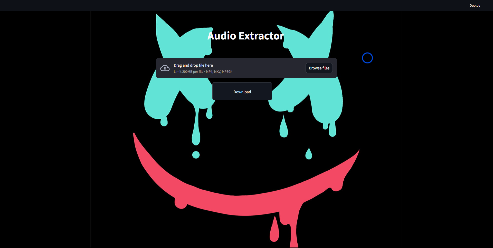
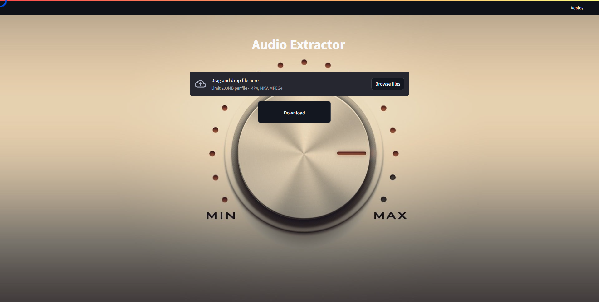
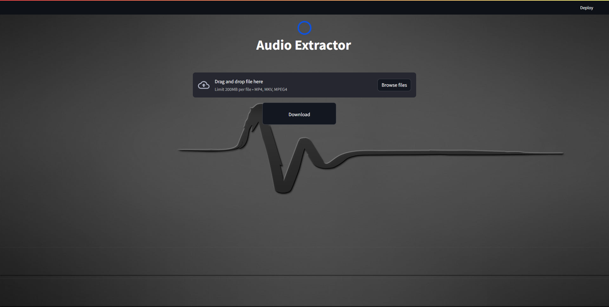
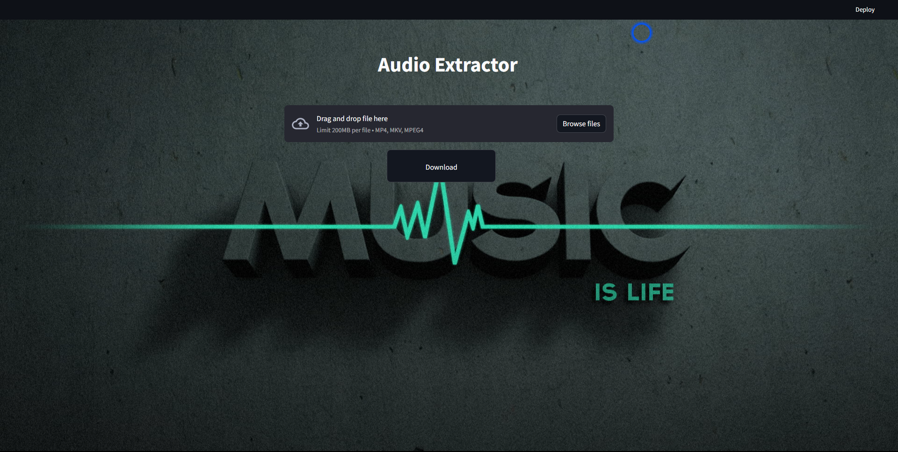

# WebApp Sreamlit : Audio Extractor 

all file in pdf [PDF](https://github.com/OWNER2PLUSAI/streamlit-webapp/blob/main/P%20%232%20-%20Audio%20Extractor/asset/Audio%20Extractor.pdf)

## 

## 

## 

## 

```python
import streamlit as st
import moviepy
import moviepy.editor
import os
import tempfile


st.set_page_config(
    page_title="Audio Extractor",
    page_icon="🤖",
)

background = [
    "https://r4.wallpaperflare.com/wallpaper/8/863/677/typography-music-music-is-life-minimalism-wallpaper-58d69cca3f2c0789ae3049a252599b00.jpg",
    "https://r4.wallpaperflare.com/wallpaper/505/498/521/music-marshmello-hd-wallpaper-28b60d5840f05c0880fcf14e781284ca.jpg",
    "https://r4.wallpaperflare.com/wallpaper/22/186/395/gray-minimalism-simple-background-monochrome-wallpaper-5940682df1ca9ddb8647083fc011362d.jpg",
    "https://r4.wallpaperflare.com/wallpaper/294/586/569/minimalism-digital-art-simple-background-music-wallpaper-f920e87d213aeddb1607886f1061f69d.jpg"
]


st.title("Audio Extractor")
try:
    # read css styel
    with open("./p2/style.css" , "r") as css:
        st.markdown(f"""<style>{css.read()}</style>""" %background[3] , unsafe_allow_html=True)
        
    f = st.file_uploader("", type=["mp4", "mkv"])
    
    # main operation
    if f is not None:
        tfile = tempfile.NamedTemporaryFile(delete=False) 
        tfile.write(f.read())
        video = moviepy.editor.VideoFileClip(tfile.name)
        audio = video.audio
        audio.write_audiofile("./audio.mp3")
        st.title("DONE!")
        
    # download btn
    col1,col2 = st.columns([0.3,0.7])
    if "audio.mp3" in os.listdir():
        with open("./audio.mp3", "rb") as file:
            btn = col2.download_button(
                    label="Download",
                    data=file,
                    file_name="audio.mp3")
    
    
    # hide footer
    st.markdown("""<style>
                    #MainMenu {visibility: hidden;}
                    footer {visibility: hidden;}
                    </style>""",unsafe_allow_html=True)
except:
    pass
            
```